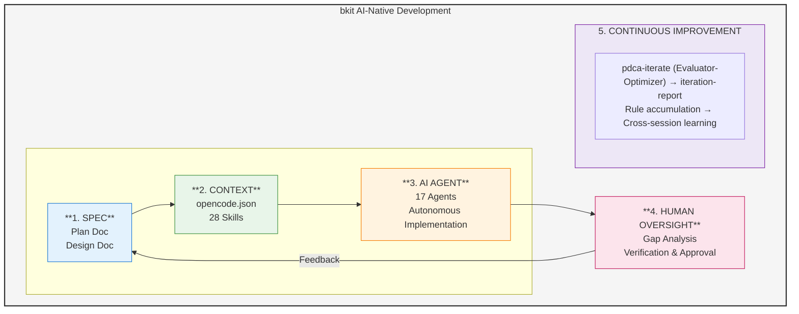

# AI-Native Development Methodology with bkit

## Overview

This document explains what AI-Native development means in the current market and how bkit realizes these principles to transform software development.

### bkit AI-Native Development Flow



---

## What is AI-Native Development?

AI-Native development is a paradigm where AI is not just a tool, but a **core collaborator** in the software development process. Unlike traditional development with AI assistance, AI-Native development fundamentally rethinks how software is designed, built, and maintained.

### Key Characteristics (Industry Consensus)

| Characteristic | Description |
|----------------|-------------|
| **Built on AI** | AI is integrated from the ground up, not added as an afterthought |
| **Break Constraints** | Removes traditional limitations on development speed and scale |
| **Continuously Improve** | Systems that get better through AI-driven iteration |
| **Proprietary AI** | Custom AI workflows tailored to specific development needs |

---

## The 4 AI-Native Principles

Based on research from industry leaders (Addy Osmani, Sapphire Ventures, DevOps.com, Augment), we identify four core principles:

### 1. Specification-Driven Development

**Principle**: Clear specifications enable AI to generate accurate, consistent code.

**AI-Native Approach**:
- Comprehensive specs before implementation
- Living documentation that evolves with code
- AI generates context-aware, project-specific code

### 2. Context-Aware Development

**Principle**: AI must understand project context to make intelligent decisions.

**Key Elements**:
- Project structure and conventions
- Existing code patterns and styles
- Business domain knowledge
- Team preferences and constraints

### 3. AI Agents as Developers

**Principle**: AI agents perform substantial development work autonomously.

**Capabilities**:
- Independent task completion
- Multi-step problem solving
- Automated testing and validation
- Self-correction through iteration

### 4. Human Oversight by Design

**Principle**: Humans provide strategic direction while AI handles execution.

**Balance**:
- AI proposes, human approves
- Critical decisions require human judgment
- Verification at key checkpoints
- Final quality assurance by humans

---

## How bkit Realizes AI-Native Development

### Principle 1: Specification-Driven Development

| bkit Feature | Implementation |
|--------------|----------------|
| **PDCA Plan Phase** | Creates detailed specifications before coding |
| **PDCA Design Phase** | Defines architecture, APIs, data models |
| **Document Templates** | Standardized formats for consistent specs |
| **Schema Skill (Phase 1)** | Establishes terminology and data structures |

**Workflow**:
```
/pdca plan {feature}    → Create specification
/pdca design {feature}  → Design architecture
→ AI generates code from specs
```

### Principle 2: Context-Aware Development (Context Engineering)

bkit implements **Context Engineering** - the systematic curation of context tokens for optimal LLM inference.

| bkit Feature | Implementation |
|--------------|----------------|
| **3 Project Levels** | Starter, Dynamic, Enterprise contexts |
| **Convention Skill (Phase 2)** | Defines naming, structure, patterns |
| **Skill System (28 skills)** | Domain-specific knowledge |
| **Hook System (8 hooks)** | Centralized context injection |
| **TypeScript Library** | State management, intent detection, ambiguity handling |

### Principle 3: AI Agents as Developers

| bkit Feature | Implementation |
|--------------|----------------|
| **17 Specialized Agents** | code-analyzer, qa-monitor, cto-lead, frontend-architect, etc. |
| **Evaluator-Optimizer Pattern** | Automatic iteration cycles |
| **gap-detector Agent** | Finds design-implementation gaps |
| **CTO-Led Agent Teams** | Parallel multi-agent orchestration |

### Principle 4: Human Oversight by Design

| bkit Feature | Implementation |
|--------------|----------------|
| **PDCA Methodology** | Checkpoint at each phase |
| **Check Phase** | Human verification of AI work |
| **Act Phase** | Human approval before proceeding |
| **Iteration Reports** | Transparent progress documentation |

---

## Getting Started with AI-Native Development

### Step 1: Initialize with Context
```bash
/starter      # or /dynamic, /enterprise
```

### Step 2: Create Specifications
```bash
/pdca plan {feature}
/pdca design {feature}
```

### Step 3: Implement with AI Agents
```bash
# AI implements based on specs
# Human reviews and refines
```

### Step 4: Iterate to Quality
```bash
/pdca iterate {feature}  # Automatic improvement cycles
/pdca analyze {feature}  # Gap analysis
```

### Step 5: Document and Learn
```bash
/pdca report {feature}   # Generate completion report
```

---

## References

- Addy Osmani - "The 70% Problem: Hard Truths About AI-Assisted Coding"
- Sapphire Ventures - "What Makes AI-Native Different"
- DevOps.com - "AI-Native vs AI-Enabled Development"
- Anthropic - "Building Effective Agents" (Evaluator-Optimizer Pattern)

---

*bkit-opencode - Vibecoding Kit for AI-Native Development*
*POPUP STUDIO PTE. LTD. - https://popupstudio.ai*
